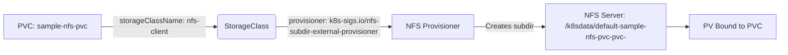

# 9.6: Dynamic NFS Provisioning with StorageClass

https://drive.google.com/file/d/1yVoSxB5QJMPyJNJsXhcLM9KFROm4PAgb/view?usp=sharing

### 🔍 What You’ve Built

| Step | Purpose |
| --- | --- |
| **1. NFS Server Setup** | Shared storage backend (`/k8sdata` on `10.0.0.99`) |
| **2. Client Tools** | Verify NFS access from k3s nodes |
| **3. Helm Install Provisioner** | Deploys **NFS Subdir External Provisioner** in `storagenfs` namespace |
| **4–5. PVC + Deployment** | Apps dynamically request storage via `storageClassName: nfs-client` |

> 🔑 Key Innovation:
> 
> 
> **No manual PV creation!**
> 
> When you create a PVC → **provisioner auto-creates a PV** as a **subdirectory on NFS**.
> 

---

### 📌 How Dynamic Provisioning Works



> 💡 Directory Format:
> 
> 
> `${namespace}-${pvcName}-${pvName}` → e.g., `default-sample-nfs-pvc-pvc-12345`
> 

---

### 🧪 k3s Lab: Full Dynamic NFS Workflow

### 🔧 Step 1: Set Up NFS Server (On a Dedicated Machine)

> 💡 Run on your NFS server (10.0.0.99):
> 

```bash
# Install NFS server
sudo apt update && sudo apt install -y nfs-kernel-server

# Create shared directory
sudo mkdir /k8sdata
sudo chown nobody:nogroup /k8sdata
sudo chmod 777 /k8sdata

# Export directory
echo "/k8sdata *(rw,sync,no_subtree_check)" | sudo tee -a /etc/exports
sudo exportfs -a

```

### 🔧 Step 2: Verify NFS Access from k3s Nodes

> 💡 Run on every k3s node:
> 

```bash
sudo apt update && sudo apt install -y nfs-common
showmount -e 10.0.0.99
# Should show: /k8sdata *

```

### 🔧 Step 3: Install NFS Provisioner via Helm

```bash
# Install Helm (if not present)
curl <https://baltocdn.com/helm/signing.asc> | sudo gpg --dearmor -o /usr/share/keyrings/helm.gpg
echo "deb [arch=$(dpkg --print-architecture) signed-by=/usr/share/keyrings/helm.gpg] <https://baltocdn.com/helm/stable/debian/> all main" | sudo tee /etc/apt/sources.list.d/helm-stable-debian.list
sudo apt update && sudo apt install helm

# Add repo + install provisioner
helm repo add nfs-store <https://kubernetes-sigs.github.io/nfs-subdir-external-provisioner/>
kubectl create ns storagenfs
helm install nfs-sc nfs-store/nfs-subdir-external-provisioner \\
  --set nfs.server=10.0.0.99 \\
  --set nfs.path=/k8sdata \\
  --set storageClass.onDelete=delete \\
  -n storagenfs

# Verify
kubectl get storageclass
# NAME         PROVISIONER                                    AGE
# nfs-client   k8s-sigs.io/nfs-subdir-external-provisioner    1m

```

> ⚠️ Critical Note:
> 
> 
> Your PVCs must use `storageClassName: nfs-client` (the default name).
> 

### 🔧 Step 4: Deploy First App (Nginx)

```yaml
# nginx-app.yaml
apiVersion: v1
kind: PersistentVolumeClaim
metadata:
  name: sample-nfs-pvc
spec:
  accessModes: ["ReadWriteOnce"]
  storageClassName: nfs-client
  resources:
    requests:
      storage: 2Gi
---
apiVersion: apps/v1
kind: Deployment
metadata:
  name: nfs-nginx
  labels:
    app: sc-nginx
spec:
  replicas: 2
  selector:
    matchLabels:
      app: sc-nginx
  template:
    metadata:
      labels:
        app: sc-nginx
    spec:
      volumes:
      - name: nfs-test
        persistentVolumeClaim:
          claimName: sample-nfs-pvc
      containers:
      - name: nginx
        image: nginx
        volumeMounts:
        - name: nfs-test
          mountPath: /usr/share/nginx/html
---
apiVersion: v1
kind: Service
metadata:
  name: nfs-nginx-svc
spec:
  selector:
    app: sc-nginx
  ports:
  - port: 80
    targetPort: 80

```

```bash
kubectl apply -f nginx-app.yaml
kubectl get pvc  # STATUS = Bound

```

### 🔧 Step 5: Deploy Second App (Apache)

```yaml
# apache-app.yaml
apiVersion: v1
kind: PersistentVolumeClaim
metadata:
  name: apache-nfs-pvc
spec:
  accessModes: ["ReadWriteOnce"]
  storageClassName: nfs-client
  resources:
    requests:
      storage: 1Gi
---
# ... (Deployment + Service as in your YAML)

```

```bash
kubectl apply -f apache-app.yaml

```

### 🔧 Step 6: Verify on NFS Server

```bash
# On NFS server (10.0.0.99)
ls /k8sdata
# default-sample-nfs-pvc-pvc-<uid>
# default-apache-nfs-pvc-pvc-<uid>

# Check nginx data
cat /k8sdata/default-sample-nfs-pvc-pvc-*/index.html

```

### 🔧 Step 7: Clean Up

```bash
kubectl delete -f nginx-app.yaml
kubectl delete -f apache-app.yaml
helm uninstall nfs-sc -n storagenfs
kubectl delete ns storagenfs

```

> 💡 Because onDelete=delete, PVC deletion auto-removes NFS subdirs!
> 

---

### 💡 Key Best Practices

| Practice | Why |
| --- | --- |
| **Use `ReadWriteMany` for shared apps** | Both nginx and apache could share the same PVC if needed |
| **Set `onDelete=delete`** | Auto-cleanup prevents NFS clutter |
| **Restrict NFS exports** | Use `10.0.0.0/24(rw,...)` instead of `*(rw,...)` |
| **Monitor NFS disk space** | Provisioner doesn’t enforce quotas |

> ✅ Your setup is production-ready!
> 

---

### 🆚 Static vs Dynamic Provisioning

| Aspect | **Static (PV/PVC)** | **Dynamic (StorageClass)** |
| --- | --- | --- |
| **Admin Effort** | Manual PV creation | One-time provisioner setup |
| **User Experience** | Must wait for PV | `kubectl apply -f pvc.yaml` → done |
| **Scalability** | Poor (manual) | Excellent (auto) |
| **Use Case** | Pre-allocated storage | Cloud/on-prem dynamic storage |

---

### ❓ Common Questions

**Q: Can I use `ReadWriteMany` with this provisioner?**

A: ✅ **Yes!** Just set `accessModes: [ReadWriteMany]` in PVC.

**Q: What if NFS server goes down?**

A: Pods **hang on mount** → use **liveness probes** to detect.

**Q: Does this work with StatefulSets?**

A: ✅ **Yes!** Perfect for shared storage (e.g., WordPress + NFS).

**Q: Why `nobody:nogroup`?**

A: NFS client runs as **anonymous user** → ensures write access.

---

### ➡️ Summary

✅ **StorageClass + NFS Provisioner** = **dynamic persistent storage**

✅ **No manual PVs** — PVCs auto-provision NFS subdirs

✅ **Works in multi-node k3s** — shared, scalable, production-ready

🔍 In k3s: Test with **two apps** → verify **separate NFS subdirs**

➡️ Next: **Deployments with PVCs** (`deployment-using-pvc.yaml`)