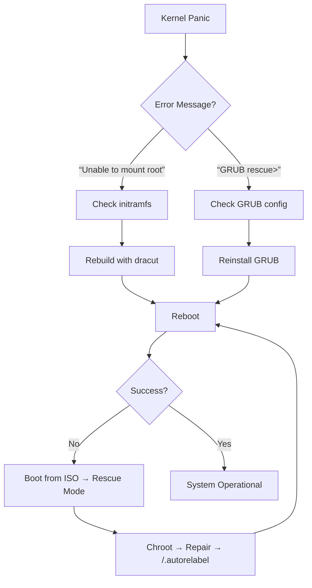

# 032: Resolving Kernel Panic Errors in Linux

## 1. Understanding Kernel Panic Causes

### Common Triggers

- **Missing/corrupted `initramfs`**: Critical drivers not loaded at boot
- **GRUB configuration issues**: Bootloader can't find kernel
- **Corrupted kernel image**: `vmlinuz` file damaged
- **Filesystem errors**: Root filesystem inaccessible

> ⚠️ Critical Insight:
> 
> 
> `initramfs` contains **essential drivers** needed to mount the root filesystem.
> 
> Without it → **"Unable to mount root filesystem"** kernel panic.
> 

---

## 2. Boot Process Overview

### Key Files in `/boot`

| File | Purpose |
| --- | --- |
| `vmlinuz-*` | Compressed kernel image |
| `initramfs-*.img` | Initial RAM filesystem (drivers/modules) |
| `grub2/grub.cfg` | GRUB bootloader configuration |
| `config-*` | Kernel build configuration |

### Boot Sequence

1. BIOS/UEFI → GRUB bootloader
2. GRUB loads `vmlinuz` + `initramfs`
3. `initramfs` loads drivers → mounts root filesystem
4. System hands off to `/sbin/init`

---

## 3. Fixing Missing/Corrupted initramfs

### Scenario: `initramfs` Deleted

```bash
# Simulate deletion (DON'T RUN IN PRODUCTION!)
sudo rm /boot/initramfs-$(uname -r).img

```

### Recovery Steps

### Method 1: Using Rescue Kernel

1. **Reboot** → Select **"Rescue kernel"** from GRUB menu
2. Login as root
3. Rebuild initramfs:
    
    ```bash
    # Get current kernel version
    uname -r    # e.g., 4.18.0-305.el8.x86_64
    
    # Rebuild initramfs (force overwrite)
    sudo dracut -f /boot/initramfs-$(uname -r).img $(uname -r)
    
    # Verify
    ls /boot/initramfs-*
    
    ```
    

### Method 2: Using Installation Media

1. Boot from **RHEL/CentOS ISO**
2. Select **"Troubleshooting" → "Rescue a CentOS system"**
3. Choose **"1) Continue"** (mounts system to `/mnt/sysimage`)
4. Chroot into system:
    
    ```bash
    chroot /mnt/sysimage
    
    ```
    
5. Rebuild initramfs:
    
    ```bash
    dracut -f /boot/initramfs-$(uname -r).img $(uname -r)
    
    ```
    

> 💡 Key Commands:
> 
> - `dracut -f` = Force rebuild (overwrites existing)
> - `mkinitrd` = Legacy command (use `dracut` in RHEL 8+)

---

## 4. Fixing GRUB Bootloader Issues

### Scenario: GRUB Configuration Deleted

```bash
# Simulate deletion (DON'T RUN IN PRODUCTION!)
sudo rm /boot/grub2/grub.cfg

```

### Recovery Steps (Using Installation Media)

1. Boot from **ISO** → **Rescue mode**
2. Chroot into system:
    
    ```bash
    chroot /mnt/sysimage
    
    ```
    
3. Reinstall GRUB:
    
    ```bash
    # Identify boot disk (usually /dev/sda)
    lsblk
    
    # Reinstall bootloader
    grub2-install /dev/sda
    
    # Regenerate config
    grub2-mkconfig -o /boot/grub2/grub.cfg
    
    ```
    
4. **Fix SELinux contexts** (critical!):
    
    ```bash
    touch /.autorelabel    # Triggers relabel on next boot
    exit
    exit
    
    ```
    
5. Reboot → Remove ISO → Boot from hard disk

> ⚠️ SELinux Note:
> 
> 
> Missing `/.autorelabel` causes **login failures** after chroot repairs.
> 

---

## 5. Key Commands Reference

| Task | Command |
| --- | --- |
| Rebuild initramfs | `dracut -f /boot/initramfs-$(uname -r).img $(uname -r)` |
| Reinstall GRUB | `grub2-install /dev/sda` |
| Regenerate GRUB config | `grub2-mkconfig -o /boot/grub2/grub.cfg` |
| Trigger SELinux relabel | `touch /.autorelabel` |
| View kernel version | `uname -r` |
| List boot files | `ls /boot` |

---

## 6. Prevention Best Practices

### ✅ Do

- **Backup `/boot`** regularly:
    
    ```bash
    sudo tar -czf /backup/boot-$(date +%F).tar.gz /boot
    
    ```
    
- **Test kernel updates** in non-production first
- **Keep rescue media** handy (ISO on USB)

### ❌ Don't

- Delete files in `/boot` without backups
- Modify GRUB config without testing
- Ignore `dracut` warnings during kernel updates

### Monitoring

- Check boot files after kernel updates:
    
    ```bash
    ls -l /boot/vmlinuz-* /boot/initramfs-*
    
    ```
    
- Verify GRUB config:
    
    ```bash
    sudo grub2-mkconfig --dry-run
    
    ```
    

---

## 7. Troubleshooting Flowchart



---

## Summary Workflow

### Fix initramfs

```bash
# From rescue kernel or chroot
dracut -f /boot/initramfs-$(uname -r).img $(uname -r)

```

### Fix GRUB

```bash
# From chroot in rescue mode
grub2-install /dev/sda
grub2-mkconfig -o /boot/grub2/grub.cfg
touch /.autorelabel

```

> 💡 Golden Rule:
> 
> 
> **Always trigger SELinux relabel** (`touch /.autorelabel`) after chroot repairs!
> 
> Without it, **system appears broken** even after successful repair.
>