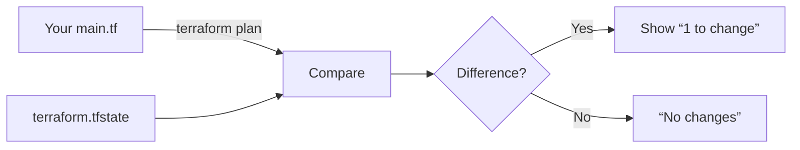

# 1.3 : First Resource — *Provision an S3 Bucket with Terraform*

---

🔗 **Video**: [Day 3: S3 Bucket Lab](https://youtu.be/...)

⏱️ **Prerequisite**: Day 1 (IaC Concepts) + Day 2 (Providers & `init`) ✅

📁 **Repo**: [`github.com/Push/terraform-aws-labs`](https://github.com/Push/terraform-aws-labs) → `/day03/`

> 🎯 Goal: Go from .tf file → live AWS S3 bucket → update tags → destroy — all with Terraform commands.
> 

---

## 🧠 Why Start with S3?

- ✅ **Simplest AWS resource** (no dependencies like VPC/subnets)
- ✅ **Instant creation** (~1 sec)
- ✅ **Global namespace** → teaches uniqueness constraints
- ✅ Perfect for learning the **Terraform workflow loop**:
    
    > init → plan → apply → modify → plan → apply → destroy
    > 

---

## 📄 Step-by-Step: `main.tf` for S3 Bucket

### ✏️ `day03/main.tf`

```hcl
terraform {
  required_version = ">= 1.5.0"
  required_providers {
    aws = {
      source  = "hashicorp/aws"
      version = "~> 6.7.0"
    }
  }
}

provider "aws" {
  region = "us-east-1"
}

# 🪣 S3 Bucket Resource
resource "aws_s3_bucket" "first_bucket" {  # ← Logical name (for Terraform internals)
  bucket = "tech-tutorials-push-2025"        # ← Must be GLOBALLY unique!
  tags = {
    Name        = "my-bucket"
    Environment = "dev"
  }
}

```

### 🔍 Key Notes:

| Field | Why It Matters |
| --- | --- |
| `bucket` | **Must be globally unique** across *all* AWS accounts/regions — use your name + year |
| `tags` | Optional, but **best practice** for cost allocation & filtering |
| `first_bucket` | Internal reference (e.g., `aws_s3_bucket.first_bucket.id`) — name it meaningfully! |

> 💡 Pro Tip: Use random provider for unique names in real projects — coming soon!
> 

---

## 🧪 Lab: Full Terraform Lifecycle

### 🖥️ Terminal Commands (Run in `day03/`)

| Command | Purpose | Expected Output |
| --- | --- | --- |
| `terraform init` | 📦 Download AWS provider plugin | `Terraform has been successfully initialized!` |
| `terraform plan` | 📋 *Dry-run*: show pending changes | `Plan: 1 to add, 0 to change, 0 to destroy.` |
| `terraform apply -auto-approve` | 🔥 **Create bucket** (skip prompt) | `aws_s3_bucket.first_bucket: Creation complete` |
| `terraform plan` *(after edit)* | 🔄 Detect changes (e.g., tag update) | `Plan: 0 to add, 1 to change, 0 to destroy.` |
| `terraform apply -auto-approve` | ✏️ Apply tag update | `aws_s3_bucket.first_bucket: Modifications complete` |
| `terraform destroy -auto-approve` | 🗑️ **Delete bucket + all contents** | `Destroy complete! Resources: 1 destroyed.` |

> ⚠️ Critical Safety Note:
> 
> - `terraform destroy` **deletes everything** managed by TF in that directory.
> - Always double-check scope before running!

---

## 🔍 How Terraform *Detects Changes*

Terraform uses the **state file** (`terraform.tfstate`) as the “source of truth”:



✅ When you changed `Name = "my-bucket"` → `"my-bucket-2.0"`:

→ Terraform saw config ≠ state → triggered an **update**, not a recreation.

> 📁 terraform.tfstate lives in your project dir (⚠️ never commit to Git! — we’ll fix this soon with remote backends).
> 

---

## 🛠️ Verify in AWS Console

1. Go to **S3 Console** → **Buckets**
2. Find your bucket: `tech-tutorials-push-2025`
3. Check:
    - ✅ **Creation time** matches your `apply`
    - ✅ **Tags** → `Name = my-bucket-2.0`, `Environment = dev`
4. After `destroy` → bucket **disappears instantly**

> 🎯 Real-World Insight:
> 
> 
> This is how teams safely promote changes:
> 
> `dev` → `staging` → `prod` (same `.tf`, different `workspace` or `variables`).
> 

---

## ❓ FAQ (Day 3 Edition)

**Q: What if my S3 bucket name is taken?**

A: You’ll get:

`Error: Error creating S3 bucket: BucketAlreadyExists`

→ ✅ Fix: Add random suffix (e.g., `-abc123`) — or use `random_id` (Day 5!).

**Q: Why use `-auto-approve`? Isn’t skipping prompts risky?**

A: Yes — **never use in prod**!

→ In CI/CD pipelines: use `-auto-approve` with strict guardrails (e.g., PR approvals).

→ In learning: saves time. In labs: always review `plan` first!

**Q: Can I manage *existing* S3 buckets with Terraform?**

A: ✅ Yes — with `terraform import` (we’ll cover in Day 4!).

→ *But*: Only import if you *own* the resource — never import shared prod resources blindly.

---

## ➡️ Summary: The Core Terraform Loop

| Phase | Command | Safety | Mental Model |
| --- | --- | --- | --- |
| **Setup** | `terraform init` | ✅ Safe | “Install plugins & connect backend” |
| **Preview** | `terraform plan` | ✅ Safe | “What *will* happen?” (READ-ONLY) |
| **Execute** | `terraform apply` | ⚠️ Changes infra | “Make it so!” |
| **Update** | Edit `.tf` → `plan` → `apply` | ⚠️ | “Drift detection + reconciliation” |
| **Cleanup** | `terraform destroy` | 🔥 Destructive! | “Tear down *only what TF manages*” |

> ✅ Golden Rule:
> 
> 
> **Always run `terraform plan` before `apply`** — treat it like `git diff` before `git push`.
> 

---