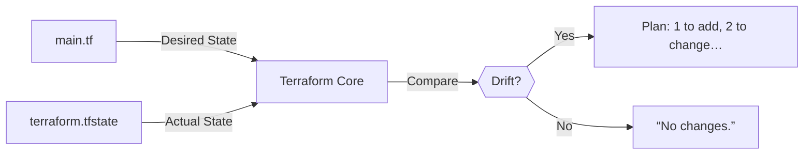
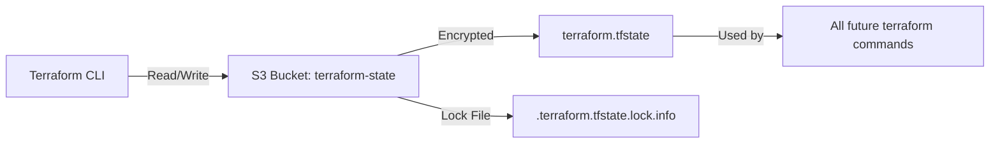

# 1.4 : Terraform State & Remote Backend — *The Source of Truth*

---

🔗 **Video**: [Day 4: State File & S3 Backend](https://youtu.be/...)

⏱️ **Prerequisite**: Day 3 (S3 Bucket Lab) ✅

📁 **Repo**: `/day04/` → [`TASK.md`](https://github.com/Push/terraform-aws-labs/blob/main/day04/TASK.md)

> 🎯 Goal: Move from local (risky!) to remote, encrypted, locked state — the foundation of production-ready Terraform.
> 

---

## 🧠 Why State Matters: Terraform’s “Memory”

> 💡 Terraform is stateful — unlike tools like CloudFormation, it remembers what it created.
> 

### How It Works:



✅ **State file (`terraform.tfstate`)** stores:

- Resource IDs (e.g., `s3-abc123`, `vpc-xyz789`)
- Attributes (e.g., `bucket_region`, `vpc_cidr`)
- Provider config metadata
- 🔐 **Sensitive data** (e.g., AWS account ID, ARNs — *not secrets*, but still confidential!)

> ⚠️ Critical:
> 
> 
> Editing `.tfstate` manually = **breaking Terraform’s trust**.
> 
> → Leads to *state drift*, failed plans, and orphaned resources.
> 

---

## 🚫 Problems with Local State (Default)

| Risk | Impact |
| --- | --- |
| 🖥️ **Local-only** | Only *you* can run `apply` — no team collaboration |
| 🔄 **No locking** | Two engineers run `apply` → state file corruption 💥 |
| 🗑️ **No backup** | Accidental `rm terraform.tfstate` = infrastructure “orphaned” |
| 📁 **Git temptation** | Committing state = exposing account IDs, resource mappings |

> ✅ Real-world analogy:
> 
> 
> Local state = saving your bank ledger on a sticky note.
> 
> Remote backend = using a *vault with audit logs and dual control*.
> 

---

## ✅ Solution: Remote Backend (S3 + Locking)

We’ll store state in **S3** with:

- ✅ Encryption-at-rest (`AES256` or KMS)
- ✅ State locking (via S3’s native `Object Lock` — *no DynamoDB needed!*)
- ✅ Versioning & backup (via S3 Versioning lifecycle)

### 📦 Architecture



> ✅ Why S3?
> 
> - Durable, scalable, low-cost
> - Native support for `ObjectLock` (replaces legacy DynamoDB locking)
> - Integrates with IAM, KMS, CloudTrail

---

## 📄 Step-by-Step: Configure S3 Remote Backend

### 🔧 Prerequisite: Create S3 Bucket *Manually*

*(This bucket **must exist before `terraform init`** — it holds your state!)*

1. **AWS Console → S3 → Create bucket**
    - Name: `tech-tutorials-push-terraform-state-2025` *(globally unique!)*
    - Region: `us-east-1`
    - ✅ **Block all public access**
    - ✅ **Enable versioning** (critical for rollback!)
    - ✅ **Enable server-side encryption** (SSE-S3 or KMS)

> 🔐 Security Note:
> 
> 
> This bucket should *only* be managed outside Terraform — it’s your **Terraform foundation**.
> 

---

### ✏️ `day04/main.tf` — Add Remote Backend

```hcl
terraform {
  required_version = ">= 1.5.0"
  required_providers {
    aws = {
      source  = "hashicorp/aws"
      version = "~> 6.7.0"
    }
  }

  # 🔑 Remote Backend: S3
  backend "s3" {
    bucket         = "tech-tutorials-push-terraform-state-2025"  # ← YOUR bucket
    key            = "dev/terraform.tfstate"                    # Path in bucket
    region         = "us-east-1"
    encrypt        = true                                        # ✅ Encryption
    use_lock_file  = true                                        # ✅ Native S3 locking
  }
}

provider "aws" {
  region = "us-east-1"
}

resource "aws_s3_bucket" "first_bucket" {
  bucket = "tech-tutorials-push-bucket-2025"
  tags = {
    Name        = "state-demo"
    Environment = "dev"
  }
}

```

### 🔍 Key Parameters:

| Field | Why It Matters |
| --- | --- |
| `key = "dev/..."` | 📁 Isolate environments: `dev/`, `staging/`, `prod/` |
| `encrypt = true` | 🔐 Encrypts state file at rest (uses S3 SSE) |
| `use_lock_file = true` | 🔒 Prevents concurrent `apply` → avoids corruption |

> 💡 Pro Tip:
> 
> 
> Use `key = "${var.env}/terraform.tfstate"` later for dynamic environments.
> 

---

## 🧪 Lab: Migrate to Remote Backend

### 🖥️ Commands (Run in `day04/`)

```bash
# 1. Initialize → connects to S3 backend
terraform init
# ✅ "Successfully configured the backend 's3'"

# 2. Verify backend is active
terraform state list
# ✅ Output: (empty at first)

# 3. Plan & Apply
terraform apply -auto-approve
# ✅ Bucket created → state auto-uploaded to S3!

# 4. Confirm in AWS Console:
#    S3 → your-state-bucket → dev/ → terraform.tfstate (✅ present!)

```

### 🔍 Inspect Remote State (Safely!)

```bash
# List resources in state
terraform state list
# → aws_s3_bucket.first_bucket

# Show full resource details (as JSON)
terraform state show aws_s3_bucket.first_bucket

# Pull latest state (sync if changed externally)
terraform state pull > current-state.json

```

> ⚠️ Never run: terraform state rm or manual .tfstate edits — unless you fully understand the risks.
> 

---

## 🛡️ State Best Practices (Production-Ready)

| Practice | How to Implement |
| --- | --- |
| 🔒 **Locking** | `use_lock_file = true` (S3 native) — *no DynamoDB needed* |
| 📁 **Environment Isolation** | `key = "dev/..."`, `key = "prod/..."` |
| 🔄 **Backup & Recovery** | Enable **S3 Versioning** → rollback to any prior state |
| 🚫 **Never Commit State** | Add to `.gitignore`: |

```
terraform.tfstate
terraform.tfstate.backup
.terraform/
``` |
| 👥 **Team Collaboration** | All engineers use *same backend config* → shared state |

> ✅ **Golden Rule**:
> **“If your state isn’t remote, encrypted, and locked — it’s not production-ready.”**

---

## ❓ FAQ (Day 4 Edition)

**Q: Why can’t I manage the *state bucket* with Terraform?**
A: 🔄 **Chicken-and-egg problem**:
Terraform needs state to manage resources → but state lives *in* the bucket → bucket must exist *before* `init`.
→ ✅ Create it manually or via bootstrap script (e.g., AWS CLI in CI).

**Q: What if `terraform init` fails with “bucket not found”?**
A: Double-check:
- Bucket name spelled correctly (case-sensitive!)
- You have `s3:ListBucket`, `s3:GetObject`, `s3:PutObject` on the bucket
- Bucket is in the *same region* as your `backend.region`

**Q: How do I recover from a corrupted state?**
A:
1. Restore from S3 Versioning (if enabled)
2. Or: `terraform import` existing resources
→ We’ll practice `import` in Day 5!

---

## ➡️ Summary: State = Your Infrastructure’s Single Source of Truth

| Concept | Local State | Remote Backend (S3) |
|--------|-------------|---------------------|
| **Location** | Your laptop | Encrypted S3 bucket |
| **Team Use** | ❌ Solo only | ✅ Collaborative |
| **Locking** | ❌ None | ✅ Native S3 locking |
| **Backup** | ❌ Manual | ✅ S3 Versioning |
| **Security** | ❌ Risky (Git leaks) | ✅ Encrypted + IAM-controlled |

> 🎯 **You just leveled up**:
> Remote state is the **#1 requirement** for Terraform in teams — and you’ve mastered it.

---

## 📚 Next Up → #1.5: Variables, `terraform.tfvars`, & DRY Config
✅ We’ll:
- Replace hardcoded values with `variables {}`
- Use `.tfvars` files for environments (`dev.tfvars`, `prod.tfvars`)
- Build reusable, parameterized modules
- Eliminate copy-paste config

> 📝 **Prep Task (Day 4)**:
> 1. ✅ Set up S3 remote backend (encrypt + lock)
> 2. ✍️ **Update your Day 3 blog**: Add a section *“Why State Management is Non-Negotiable”*
>    - Explain local vs remote state
>    - Share screenshot of your S3 state bucket (blur bucket name if needed)
> 3. 📤 Submit via GitHub (`/day04/TASK.md`)

---

You’re not just writing config — you’re building **infrastructure with integrity**. Every line of `.tf` is now backed by a secure, auditable foundation. 🏗️
Ready for variables? Send the Day 5 transcript — I’ll make it crystal clear.
```

